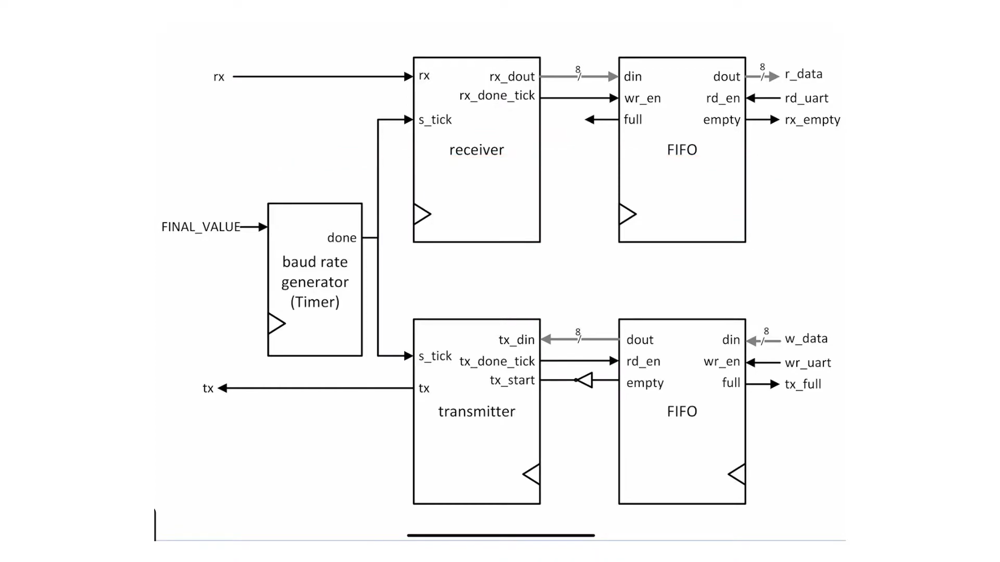

This repository contains an implementation of the **UART (Universal Asynchronous Receiver-Transmitter)** protocol. The implementation is based on the block diagram shown below, which illustrates the interaction between various modules such as the **baud rate generator**, **receiver**, **transmitter**, and **FIFO buffers**.

## Overview

### Features
- **Baud Rate Generator**:
  - Configurable timer to generate baud rate ticks.
  - Synchronizes data transfer between transmitter and receiver.
- **Receiver**:
  - Handles serial-to-parallel conversion.
  - Provides received data to the FIFO buffer.
- **FIFO Buffers**:
  - Separate buffers for received and transmitted data.
  - Ensures smooth data handling between modules.
- **Transmitter**:
  - Handles parallel-to-serial conversion.
  - Sends data based on baud rate ticks.
